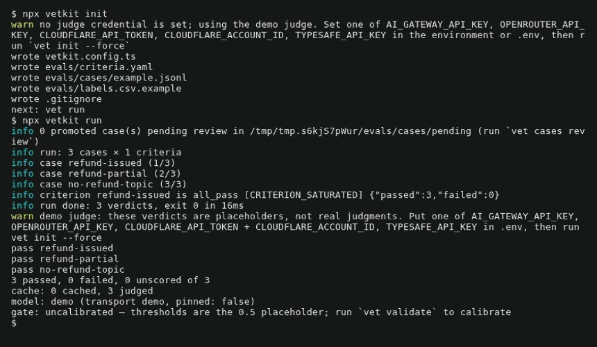

# vetkit

Generate, validate and run LLM evals judged by typed decisions

[](https://www.npmjs.com/package/vetkit)
[](https://scorecard.dev/viewer/?uri=github.com/MelsovCOZY/vetkit)

## Quickstart

```sh
npm i -D vetkit
npx vetkit init
npx vetkit run
```

Requires Node.js `^22.18.0 || >=24.11.0`. With no key set, `npx vetkit init` writes `judge: demoJudge` (imported from 'vetkit') into the config, so the first run needs no key and marks its verdicts `demo`. For real verdicts, put a judge key in `.env`:

```
OPENROUTER_API_KEY=...
```



## CI

<!-- snippet: file=.github/workflows/vet.yml -->

```yaml
name: vet
on: pull_request
permissions:
  contents: read
  pull-requests: write
jobs:
  vet:
    runs-on: ubuntu-latest
    steps:
      - uses: actions/checkout@v4
      - uses: actions/setup-node@v4
        with:
          node-version: '22'
      - run: npm ci
      - uses: MelsovCOZY/vetkit@v0
        env:
          OPENROUTER_API_KEY: ${{ secrets.OPENROUTER_API_KEY }}
```

`vet run` is an uncalibrated threshold gate and `vet run --gate` is the calibrated one, which needs labels and a committed `criteria.lock.json`. The steps to the calibrated gate are in the [CI gate walkthrough](docs/ci-gate.md); the action's inputs are in the [action README](action/README.md).

## vs promptfoo / evalite / DeepEval / Braintrust

| Question                               | vetkit                                                                        | promptfoo                                   | evalite                            | DeepEval                              | Braintrust           |
| -------------------------------------- | ----------------------------------------------------------------------------- | ------------------------------------------- | ---------------------------------- | ------------------------------------- | -------------------- |
| First result without a key             | yes: `demoJudge` verdicts, marked `demo`                                      | not checked                                 | not checked                        | not checked                           | not checked          |
| Calibrated, pinned gate with a lock    | yes: `vet validate` writes `criteria.lock.json`, `vet run --gate` enforces it | not checked                                 | not checked                        | not checked                           | not checked          |
| Provider neutrality                    | any OpenAI-compatible generator; the judge transport is a config value        | not checked                                 | not checked                        | not checked                           | not checked          |
| Telemetry                              | zero telemetry                                                                | on by default, opt out with an env variable | not checked                        | on by default, opt out                | not checked          |
| Install scripts or native dependencies | no install scripts, no native dependencies                                    | no install script; native optional packages | native dependency (better-sqlite3) | Python package, not applicable to npm | `postinstall` script |

"Not checked" means the fact was not verified for this table. Sources: the npm manifests of [promptfoo](https://www.npmjs.com/package/promptfoo), [evalite](https://www.npmjs.com/package/evalite) and [braintrust](https://www.npmjs.com/package/braintrust) as of promptfoo 0.123.1, evalite 0.19.0 and braintrust 3.35.0; the [promptfoo telemetry page](https://www.promptfoo.dev/docs/configuration/telemetry/); the [DeepEval data privacy page](https://deepeval.com/docs/data-privacy).

## Trust

- License: Apache-2.0.
- vetkit has zero telemetry: it makes no network call except to the judge and generator endpoints you configure, and a test fails the build if analytics code appears in shipped sources.
- The packages have no install scripts and no `postinstall`; the release check fails a tarball that has one.
- The judge is Jev, which answers typed choice and score questions and cannot generate text. A gateway preset serves it only as the alias `typesafe-ai/jev`, so each judgment records the served model id and `pinned: false`; the `openrouter` and `typesafe` presets serve a fixed build and record `pinned: true`. `vet run --gate` refuses an unpinned judge unless you allow it.
- Jev scores drift run to run, so thresholds use a tolerance band and at least 3 repeats. Never gate on `confidence` alone.
- Maintenance: releases are cut from master through changesets when changes land, and a deprecated feature stays for at least one minor release, with a notice, before it is removed.

## Packages

| Package                                                                       | Purpose                                                                  |
| ----------------------------------------------------------------------------- | ------------------------------------------------------------------------ |
| [`vetkit`](packages/cli)                                                      | the `vet` CLI                                                            |
| [`@vetkit/core`](packages/core)                                               | criteria loading and editing, judging and verdict logic                  |
| [`@vetkit/spec`](packages/spec)                                               | shared types, error codes, JSON validation and adapter contracts         |
| [`@vetkit/judge-jev`](packages/judge-jev)                                     | Jev judge client with configurable transport presets                     |
| [`@vetkit/generator-openai-compatible`](packages/generator-openai-compatible) | generator for any OpenAI-compatible chat endpoint                        |
| [`@vetkit/scorers`](packages/scorers)                                         | Braintrust/autoevals/Evalite scorer, promptfoo assertion, vitest matcher |
| [`@vetkit/export-vitest`](packages/export-vitest)                             | exporter that emits a vitest scorer and test file                        |
| [`@vetkit/source-jsonl`](packages/source-jsonl)                               | trace source reading JSONL                                               |
| [`@vetkit/source-otlp`](packages/source-otlp)                                 | trace source reading OTLP files                                          |
| [`@vetkit/sink-langfuse`](packages/sink-langfuse)                             | sink that writes verdicts as Langfuse scores                             |
| [`@vetkit/sink-otel`](packages/sink-otel)                                     | sink that writes verdicts as OpenTelemetry logs and OpenInference spans  |

## Contributing

See [CONTRIBUTING.md](CONTRIBUTING.md) for setup, scripts, the release chain and recovery.
